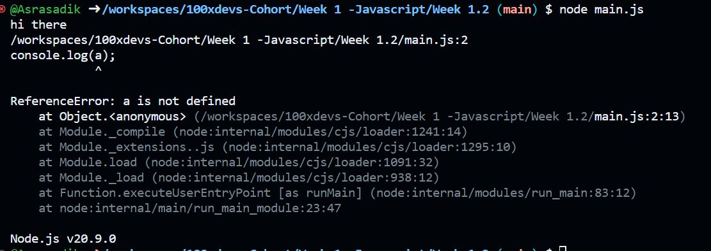

javascript is interepreted language which runs line by line
if there is any error it will run partially
example:

```
console.log("hi there")
console.log(a)
```

here line 1 runs
and gives error for line 2


Browser understands only html/css/js nut not technically, because there are some ways where we can run c, c++ langage in broswer but 90% of the time we use javascript

what are the languages that are better than js 
